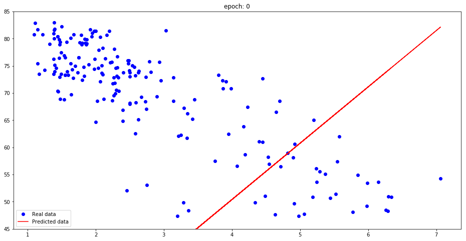

# Stanford University: Tensorflow for Deep Learning Research
Syllabus and Lecture Notes  http://web.stanford.edu/class/cs20si/syllabus.html  
Code Examples  https://github.com/chiphuyen/stanford-tensorflow-tutorials  
**simple linear regression example using placeholders**

## Lecture1&2-Overview-of-tensorflow-and-it's-operation
[overview and basic operations](http://nbviewer.jupyter.org/github/wangwuqi/stanford-tensorflow-tutorial/blob/master/Lecture1%262-Overview-of-tensorflow-and-it%27s-operation.ipynb)
## Lecture3-Basic-Models-in-Tensorflow
[simple linear regression](http://nbviewer.jupyter.org/github/wangwuqi/stanford-tensorflow-tutorial/blob/master/Lecture3-Basic-Models-in-Tensorflow.ipynb)
